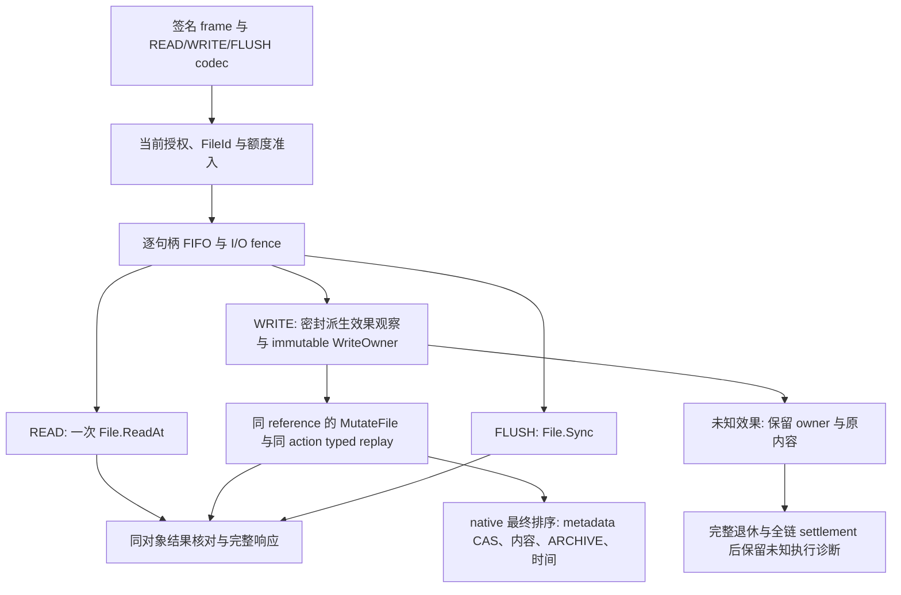

# Agent Note: SMB 文件内容访问

Status: proposed

## 问题

Windows 程序取得 SMB FileId 后，需要通过该句柄读取、范围写入、追加和刷新原对象。名字被改名、删除或替换时，已有句柄不能转向替代物。写入必须在调用中确认服务端结果，内容与 Windows `ARCHIVE` 同时生效；断线、权限变化、关闭和资源饱和不能让未知写入被当作未发生，或让已经接受的内容失去持有者。

本提案细化[Windows 总提案](2026-09-16-windows-network-drive-support.md)的 **7.4a**。依赖[有界 CREATE/CLOSE](../../implemented/feature/2026-09-28-smb-bounded-create-close.md)的签名分派、typed FileId、完整 backend/session 身份、共享准入和关闭 owner；[文件及 volume 信息提案](2026-09-28-smb-file-data-information.md)保留 7.4b/c 的信息类、EOF 和容量设计。

需求依据为 [R-FS-6、R-FS-7、R-FS-8、R-CON-1、R-ERR-1 至 R-ERR-4、R-SEC-5、R-INT-8、R-WIN-2、R-WIN-5、R-WIN-10](../../../../docs/spec/requirements.md)。跨请求读取快照、Windows 私有缓存失效和最终原生支持资格按各自需求及后续提案验收。

### 现有结构与缺口

| 已有事实与源码 | 对设计的约束 |
|---|---|
| [`File.ReadAt`](../../../../packages/storage/files.go) 的注释：`ReadAt returns up to length bytes at offset with attributes from the same content revision.` | 一次 READ 使用同一个 `FileRead{Data, Attr}`，不能补读拼成跨 revision 的成功结果。 |
| [`OpenMetadataAccess`](../../../../packages/storage/file_identity.go) 的注释：`Zero grants neither Stat nor metadata mutation; byte rights and Uses do not confer metadata rights.` | WRITE-only 句柄不能借公开 Stat 或任意 metadata 更新取得额外属性权限。 |
| [`openFile.MutateFile`](../../../../packages/storage/objectstore/file_mutation.go) 对非空 `Attr`／`Metadata` 检查 `WriteMetadata`；native [`conditional_file.go`](../../../../packages/metastore/sqlite/conditional_file.go)独立核对该权限。 | `Data + Metadata` 的普通组合不能直接实现 byte-only WRITE 的 ARCHIVE。需要固定的、经授权的数据派生效果。 |
| [`FileMutationKind`](../../../../packages/storage/capabilities.go) 已含 `MutateWriteAt` 和 `MutateAppend`。 | 复用同一个身份动作和 native 追加排序，不增加按 Stat 计算 EOF 的追加路径。 |
| [`fileHandle`](../../../../packages/smb/file_handles.go)保存引用、NodeID、access 与 close owner；`beginFileWork`／`fenceFileWork` 计量整 tree 工作。 | 新增逐句柄准入和排空，不能用 tree 计数代替同句柄 CLOSE 与 I/O 的排序。 |
| [`FileActionReceipt`](../../../../packages/storage/capabilities.go)只有 `Action, Operation, Outcome`。 | Completed 不提供原 Attr 或完整 backing settlement；必须重投原 typed 方法核对结果。 |
| [`requiredCredits`](../../../../packages/smb/connection.go)按 packet 字节数计费。 | READ/WRITE 改按请求 Length 计费，防止小 READ 请求少计大量输出及 64 KiB WRITE 多计 header。 |

## 提案

### 交付范围与可继续扩展的结构

本 PR 交付 SMB 3.1.1 regular-file READ、flags=0 的 WRITE、FLUSH：逐请求授权、同对象事实校验、byte-only Windows 属性观察／派生效果、同动作恢复、逐句柄 FIFO、CLOSE／父退休排空、预算及未确认内容的明确所有权。wire、storage、native、HTTP 和 wrappers 的变更均服务于这个目的。

| 延后工作 | 分类、代价与结构限制 | 本段请求结果 |
|---|---|---|
| 7.4b 文件 QUERY_INFO、Basic／EOF SET_INFO | 功能；新增类表和 codec，复用本段句柄 gate、action owner、条件效果。不得为 EOF 建另一条内容／ARCHIVE 提交路径。 | 信息命令保持明确 unsupported。 |
| 7.4c volume 信息与 geometry | 功能；新增可信 presentation 与容量投影。有效 UNBUFFERED／WRITE_THROUGH 配对及所需 CREATE 能力依赖可信 geometry，须另外切定实施范围，不自动并入 7.4c。不得假设固定 sector／cluster，也不得让缺席 geometry 阻止普通字节 I/O。 | volume 信息、UNBUFFERED、WRITE_THROUGH+UNBUFFERED 明确 unsupported；WRITE_THROUGH-only invalid parameter。 |
| [目录枚举](2026-09-28-smb-directory-enumeration.md)、目录 FLUSH | 功能；目录 FLUSH 需真实引用 Sync 能力，不能复用普通文件字节引用或回成功空响应。 | 目录内容访问与 FLUSH 明确 unsupported。 |
| [范围锁／CANCEL](2026-09-28-smb-range-lock-cancel.md) | 保证；后续在同一 authority 对象保护排序加入范围语义。不得绕过受控 File 引用直接访问 object store。 | LOCK／CANCEL 保持现有拒绝行为。 |
| [名字修改](2026-09-28-smb-guarded-name-mutation.md)、[关闭删除](2026-09-28-smb-close-delete-obligation.md) | 功能与持久义务；追加独立受 guard 动作。FileId 不保存可用于重新打开的旧路径。 | 不新增 rename／disposition／delete-on-close。 |
| [通知与缓存](2026-09-28-smb-change-notify-cache-coherence.md)、[原生夹具](2026-09-28-smb-native-wnet-fixture.md)、[资格](2026-09-28-smb-native-qualification.md) | 保证和环境；后续验证 redirector 缓存及完整操作集。本段保留对象、revision、action 关联。 | 本段通过不宣布 Windows drive 完成。 |

既有 SQLite release、DropUseExact、close receipt、history 与 close wire 保持原机制。新增 gate 在调用这些机制前完成 I/O 排空；没有持久离线写入日志、旧 session 恢复或新 authority 自动重放。

### 架构与数据流



SMB 解释 Windows 位与 wire；storage 描述固定 namespace 转换、条件和身份；native 在既有最终 publication 内完成效果；HTTP 传递真实语义及独立 action 恢复；replica 保持原结果确认与 barrier。不同 FileId 可以并行，即使指向同一个 NodeID；同对象内容顺序仍由 authority 决定。

### 目录与模块所有权

以下是计划位置；既有文件只在相关职责内调整，新增文件与其 package-local tests 相邻。

| 路径 | 职责 |
|---|---|
| `packages/smb/internal/wire/file_io.go` | 三类请求／响应、安全 extent、长度及 offset 解码；不访问 backing。 |
| `packages/smb/commands_file_io.go` | 身份、rights、当前授权、READ 结果、WRITE／FLUSH 调度及 NTSTATUS。 |
| `packages/smb/file_io_gate.go` | 逐句柄 FIFO、准入、取消、fence、排空；不持锁调用 backing。 |
| `packages/smb/write_owner.go` | WRITE 原动作、复制内容、typed 恢复与终态执行失败事实。 |
| `packages/smb/flush_owner.go` | 无 Data 的引用 Sync confirmation、有限重试、排空与共享失败事实投影。 |
| `packages/smb/content_metadata.go`、既有 `windows_metadata.go` | 编译八字节固定效果、验证 Windows payload、READONLY 与 ARCHIVE；不保存 authority 状态。 |
| SMB `config.go`、`connection.go`、status、`commands_close.go`、退休模块 | owner／字节／队列上限、credits、完整响应预留、停止与失败事实确认。 |
| `packages/storage/content_metadata.go`、`capabilities.go`、validation | 通用 descriptor、观察 capability、OpenAt enrollment、mutation effect index 与合法性。 |
| `packages/metastore/capabilities.go`、`sqlite/content_metadata.go`、atomic open／files／conditional publication | exact-reference 观察、复制密封效果及同事务验证／应用。 |
| `packages/storage/objectstore/content_metadata.go`、mutation／actions | 引用能力、immutable descriptor、原动作 digest 和 typed replay。 |
| HTTP DTO、capability、operation／authorization、explicit pending 模块 | 有界 descriptor、观察操作、真实附加授权、按 action 隔离恢复。 |
| `packages/storage/{locked,limited,replicated}` | 完整链 capability 转送及现有结果／barrier 语义。 |

实施时同步 `docs/design/client/smb-endpoint.md`、受影响 server 契约、`docs/testing.md` 与 implemented note。本提案不预先把计划写成已交付架构。descriptor 仅属于 session/reference 状态，不新增 schema 或旧数据兼容分支。

### 数据派生 metadata 的密封描述

新能力不授予公开 metadata 方法。下面给出预期类型形状；最终命名可以随相邻 API 一致化，字段的来源和限制保持不变。

```go
type ContentMetadataEffect struct {
    Namespace     string
    PayloadBytes  int
    PresentPrefix []byte
    AbsentPayload []byte
    ClearMask     []byte
    SetMask       []byte
}

type ContentMetadataObservation struct {
    NodeID uint64
    Value  *OpaquePayload // nil only for confirmed namespace absence
}

type ReferenceContentMetadata interface {
    CheckContentMetadata() error
    ObserveContentMetadata(context.Context, uint16) (ContentMetadataObservation, error)
}

// OpenAtOptions gains ContentMetadataEffects []ContentMetadataEffect.
// FileMutation gains ContentEffects []uint16.
```

OpenAt 接受固定、有界的效果向量并复制到 exact reference；本入口只 enrollment 一个效果。descriptor 的数量、namespace、prefix、payload 和 mask 长度都在配置上限内，mask 必须等于 PayloadBytes，prefix 不得受 mask 修改，AbsentPayload 必须满足同一格式。相同 namespace 的重复效果与不自洽格式在打开效果前失败。

SMB 编译 `Namespace="smb.windows"`、`PayloadBytes=8`、`PresentPrefix="SMW\x01"`、`AbsentPayload="SMW\x01" + uint32le(0)`，清除 NORMAL、设置 ARCHIVE。其它位及所有其它 namespace 保留。八字节格式来自既有 [`encodeWindowsMetadata`](../../../../packages/smb/windows_metadata.go)；Windows 常量不进入 storage、native 或 HTTP 的通用验证代码。

**Enrollment 与逐操作授权。** `OpenAccess`／`authz.AccessRequest` 携带准确的 immutable descriptor。当前业务 policy 必须明确批准 `OpFileSetMetadata` 与新有界语义 `OpFileObserveContentMetadata`，并检查其附加效果；byte-write 与 descriptor 准入在打开前核对。每次非空 WRITE 及同 action typed replay 都将原 index 解析为已密封 descriptor，按当前 `OpFileSetMetadata` 重新授权；`Metadata=nil` 不构成旁路，OpenAt 批准不是终身授权。恢复被拒绝保留原未知与 owner。批准 descriptor 不改变 Windows DesiredAccess，也不改变 `OpenAtOptions.MetadataAccess`。没有 FILE_WRITE_ATTRIBUTES 的句柄仍不能公开 Stat、SetAttr、SetMetadata 或任意 MutateAttributes。受影响 wrapper 的 checker 必须证明全链支持；不能只检查顶层类型。

**观察。** `ObserveContentMetadata(effectIndex)` 只读取已密封 descriptor 的一个 namespace，检查 byte-write、exact live reference、NodeID、当前授权及 index。结果仅含 NodeID 与该 namespace 的存在性、payload、opaque version；不返回所有属性。缺席、存在但空、格式损坏和未知版本分别处理，不用默认 payload 掩盖未知。SMB 验证完整 Windows 位，READONLY 不允许的非空写入在 mutation 前拒绝。

**最终提交。** WRITE 提交已观察版本／缺席的 `ExpectedMetadata` 和 effect index；每个被选效果的 enrolled namespace 必须有显式 ExpectedMetadata entry，空 token 只代表已确认缺席，遗漏 entry 是非法请求。该路径的 `Attr` 与任意 `Metadata` 均为空。native 在既有 publication 排序点检查 exact reference、数据许可、sealed descriptor、token 及 payload 长度／prefix，以固定表达式 `new=(old &^ ClearMask) | SetMask` 转换同一已验证 payload，然后一次提交内容、派生 metadata、时间和 change log。不存在 namespace 时只使用已批准 AbsentPayload。调用方不能提交替代 payload、换 namespace 或修改 READONLY/HIDDEN/SYSTEM。

`ContentEffects` 本段只用于非空 `MutateWriteAt`／`MutateAppend`。空 WRITE 的 effects 为空；effect-only、任意属性混合、未 enrollment 的 index 与重复 index 在效果前失败。将来 EOF 可在同一机制中增加 `MutateTruncate`，本段不发布其命令。

OpenAt digest 包含全部 descriptor；WRITE digest 包含 reference target、descriptor、indices、data、offset／kind 与 metadata token。每处 byte slice／map 深复制，重投使用原封存值。改动 alias、重投换 descriptor 或同 ID 换内容均不能改变原动作。其它入口没有 enrollment 时继续原中立写入语义，不自动解释 Windows 位。

### wire、访问权与结果

保留当前 SMB **3.1.1** dialect。解码基于每个 compound command extent；related FileId 在 frame-local context 中继承，原签名字节不改。

| 操作 | 当前业务授权语义 |
|---|---|
| READ | OpFileRead。 |
| 非空 WRITE | OpFileWrite，以及对原 enrolled descriptor 解析后的 OpFileSetMetadata；属性观察另需 OpFileObserveContentMetadata。 |
| 空 WRITE | OpFileWrite；无 ContentEffects，不增加 metadata 更新授权。 |
| FLUSH | OpFileSync。 |

每次请求在 enqueue／effects 前核对当前实际操作授权，排队取得 turn 后、backing dispatch 前再次核对；原 action 的每次 typed RPC replay 同样按实际操作重新授权。拒绝不能把此前已 dispatch 的 Unknown 变成 NotExecuted，也不能丢弃原 owner；未 dispatch 的队列项拒绝才可证明本项无效果。

| 命令 | wire 与访问权 | backing 与响应 |
|---|---|---|
| READ | StructureSize 49，固定字段 48 字节；regular File、FILE_READ_DATA；offset 非负，offset+Length 不超过 MaxInt64。 | 一次 ReadAt；响应 StructureSize 17、固定 16 字节加数据，DataRemaining／flags／reserved 为零。 |
| WRITE | StructureSize 49，固定字段 48 字节；regular File、FILE_WRITE_DATA 或 FILE_APPEND_DATA；非空数据的 DataOffset 在 112..256，范围完整落在当前 command。 | 原 action 的条件 WriteAt／Append；确认全部数据后 Count=len(Data)，Remaining／channel-info 为零。 |
| FLUSH | StructureSize 24，固定 24 字节；忽略 Reserved1/2；regular File、FILE_WRITE_DATA 或 FILE_APPEND_DATA。 | 原引用 File.Sync；确认后返回固定 4 字节、StructureSize 4。目录明确 unsupported。 |

依据：[READ 请求](https://learn.microsoft.com/en-us/openspecs/windows_protocols/ms-smb2/320f04f3-1b28-45cd-aaa1-9e5aed810dca)、[WRITE 请求](https://learn.microsoft.com/en-us/openspecs/windows_protocols/ms-smb2/e7046961-3318-4350-be2a-a8d69bb59ce8)、[FLUSH 请求](https://learn.microsoft.com/en-us/openspecs/windows_protocols/ms-smb2/e494678b-b1fc-44a0-b86e-8195acf74ad7)与[FLUSH 处理](https://learn.microsoft.com/en-us/openspecs/windows_protocols/ms-smb2/026984f6-38af-4408-8200-50557eb0a286)。TCP WRITE DataOffset 不增加未经规范要求的八字节对齐限制。

READ 验证返回 Attr.ID 与句柄一致、regular kind、非负 Size、有效 allocation、Data 长度不超过请求及 captured EOF。正 Length 且在 captured EOF 前返回零字节违反中立 ReadAt 契约，按 I/O 错误；合法的零字节结果（包括 Length=0）为 STATUS_END_OF_FILE。正短读允许；低于 MinimumCount 为 END_OF_FILE，达到 MinimumCount 成功。MinimumCount>Length 仍按结果比较处理，不增加 invalid-parameter 规则。失败伴随的部分结果不编码成功，也不以第二次 ReadAt 填满原请求。依据：[READ 响应](https://learn.microsoft.com/en-us/openspecs/windows_protocols/ms-smb2/3e3d2f2c-0e2f-41ea-ad07-fbca6ffdfd90)、[READ 处理](https://learn.microsoft.com/en-us/openspecs/windows_protocols/ms-smb2/21e8b343-34e9-4fca-8d93-03dd2d3e961e)。

WRITE_DATA 可按普通有效 offset 覆盖或扩展。APPEND_DATA-only 始终使用 `MutateAppend`，忽略普通 offset 对写入位置的选择；显式全一 offset（-1）同样选当前 authority EOF。其它高位 offset（包括 -2）及普通范围溢出在效果前拒绝。追加位置与数据／ARCHIVE 同动作排序，不先 Stat 再绝对 WriteAt。SMB 不保存 file-position cursor；显式 offset 操作不更新位置。append-only 的 offset 规则是结合 [NtWriteFile](https://learn.microsoft.com/en-us/windows-hardware/drivers/ddi/ntifs/nf-ntifs-ntwritefile)、[SMB Windows 写入准入](https://learn.microsoft.com/en-us/openspecs/windows_protocols/ms-smb2/a64e55aa-1152-48e4-8206-edd96444e7f7#Appendix_A_365)与 object-store 委托作出的端点投影，须有具体普通-offset append 验收；[MS-FSCC 位置说明](https://learn.microsoft.com/en-us/openspecs/windows_protocols/ms-fscc/d4bc551b-7aaf-4b4f-ba0e-3a75e7c528f0)支持无 SMB cursor。

空 WRITE 仍经同身份、live reference、当前 write 授权、预算与合法 offset 校验，用显式原 action 的零 Data `MutateWriteAt`、空 ContentEffects 获取 captured Attr，返回 Count=0。它不改变内容、EOF、ARCHIVE 或时间；不调用公开 Stat，不借零长度请求探测任意 metadata。原生零效果检查已存在于 [`conditional_file.go`](../../../../packages/metastore/sqlite/conditional_file.go)；SMB 使用该 explicit 路径，既有普通 `WriteAt(empty)` 不在本 PR 修改。依据：[MS-FSA Write](https://learn.microsoft.com/en-us/openspecs/windows_protocols/ms-fsa/fbf656c3-b897-4b9c-abfd-7c8d876d77a1)。

WRITE_THROUGH 的有效 unbuffered 配对与相关 CREATE 能力留给可信 geometry 的后续工作；本段不以普通 buffered mutation+Sync 模拟它。

| channel／flags | 处理 |
|---|---|
| Channel NONE | 忽略 RemainingBytes 与 channel-info offset／length，包括非零垃圾值；READ Padding 忽略。 |
| RDMA channel | TCP 入口效果前 INVALID_PARAMETER。 |
| READ REQUEST_COMPRESSED | compression 未协商，允许普通未压缩响应；不授予 compression。 |
| READ／WRITE UNBUFFERED | 效果前 NOT_SUPPORTED；sector alignment 的可信 geometry 属于 7.4c。 |
| WRITE_THROUGH、未带 UNBUFFERED，且 CREATE 未选择 NO_INTERMEDIATE_BUFFERING | SMB 3.1.1 要求效果前 INVALID_PARAMETER；当前 CREATE 排除该选项，因此 WRITE_THROUGH-only 不执行 mutation。 |
| WRITE_THROUGH + UNBUFFERED | valid unbuffered 能力与可信 geometry 尚未交付，本段效果前 NOT_SUPPORTED；不扩展 CREATE。 |
| 未知 READ／WRITE flag | 项目明确 unsupported 策略；WRITE 规范对未定义位使用 SHOULD ignore，本文不把拒绝写成协议 MUST。 |

规则依据：[WRITE 处理](https://learn.microsoft.com/en-us/openspecs/windows_protocols/ms-smb2/829f93f5-ed10-4f12-8347-42d235019459)、[READ 处理](https://learn.microsoft.com/en-us/openspecs/windows_protocols/ms-smb2/21e8b343-34e9-4fca-8d93-03dd2d3e961e)。既有 CREATE FILE_WRITE_THROUGH／NO_INTERMEDIATE_BUFFERING 支持范围不在这里扩展。

### 逐句柄 FIFO 与 CLOSE

每个 handle 有 `ioMu`、有界 FIFO、递增 admission sequence、running pointer 与 fenced 状态。READ、WRITE、FLUSH 按该句柄已接纳顺序开始 backing 调用；一个运行请求完成后释放 turn。排队请求已计入 tree／global／per-handle 请求数量，但取得 turn 前不复制待写 data。不同句柄不共享 I/O gate。

准入短锁顺序为 `authority install → tree.fileMu → session.mu → ioMu`；检查 exact handle、tree/session 归属、身份、live 状态及限额，登记 active 与队列，然后全部解锁。队列取消可在 dispatch 前移除并证明该项无效果；running context 取消只取消等待，不能证明提交未发生。整个 backing I/O、授权、receipt 查询和 Sync 不持这些锁。

普通 I/O 不取得 `closeLifetime`。CLOSE 取得 `requestCloseMu → closeLifetime`，在 ioMu 下 fence 并拒绝新准入、移除未 dispatch 的排队项，放锁等待 running 项退出；随后对原 WriteOwner 作有界 reconciliation，再进入已有 exact close。结果仍 Unknown 也可继续关闭以取得 no-future-publication／settlement 证明，不能要求 ExecutionKnown 后才允许 close。带 post-query 标志的 CLOSE 属性捕获放到 fence／drain 后，不能报告排空前旧 Attr。CLOSE 的授权仍按真实操作核对；属性读拒绝仍不能变成隐含 metadata 权利。

WRITE 结果未知时，当前执行结束、active 计数和 turn 释放，原 owner 继续计费。未知 owner 不伪装成无限 active I/O；该句柄后续内容调用失败并触发有界恢复，不能跨越未知写入继续成功。其它 handle、session renewal、状态查询与清理继续。FLUSH 排在该句柄先前写入后；它不是把此前尚未同步发布的内容补交 authority。

tree／export／session 退休先封全部相关 tree 和 handle，移除排队项并排空 running；在既有 closeLifetime 和完整成员检查保护下结算每个 write owner，再关闭引用或取得完整父 session 释放／settlement 证明。该证明只说明原 reference／authority 不会再产生效果，不证明某次未知 WRITE 已执行或未执行。仍有 live sibling tree 时不得通过关闭共享父 authority 解决某个句柄的未知状态。

### WriteOwner 与同动作恢复

WRITE dispatch 前预留 owner slot、retained data bytes、descriptor／条件 token、诊断以及完整响应容量；成功预留后只复制 Data 与最小 immutable command，不保存整个 SMB frame。一个句柄最多保留一个未结算写意图。owner 绑定 export、session/backend descriptor、FileId generation、NodeID、sequence、原 action、kind／offset、metadata observation、Data、原 error 与 typed result。

```text
Reserved → Dispatched → ExecutionKnown → Settled
                 └──→ ResultUnknown ── same-ID query/replay ──┘
ResultUnknown + complete original retirement and settlement → terminal WriteFailure facts
```

| 原动作状态／结果 | 允许的下一步 |
|---|---|
| typed MutateFile 成功，Attr 与目标／结果相符且 backing settlement 完成 | ExecutionKnown；原 WRITE 可回应，不另调用 FLUSH。 |
| Completed receipt | 用同 ID、同 reference、同 immutable command 重投原 MutateFile，恢复原 typed Attr／error 与全链 settlement；receipt 本身不能宣布成功。 |
| Bound NotExecuted，Operation 对应原 mutation | 只有明确 metadata 条件冲突才重新观察；`MaxConditionRetries=2`，原动作加最多两次新 action，耗尽返回冲突。其它确定错误直接报告。 |
| NotExecuted 但 Operation 为空、Unknown、Retired、查询失败、incarnation 变化 | 不作为未执行证明，不新建 action；当前调用 I/O 错误并保留 owner。 |
| Pending | 用清理／恢复专属有界 deadline 查询或同 ID replay；等待到限后保留未知责任。 |

fresh-condition retry 与原动作恢复分开计数。重读 token 只能发生在原绑定动作确定未执行后；HTTP 重试或应用再次 WRITE 不构成同一个 action。目标／operation／digest 不匹配、丢失结果、partial Attr 与错误、retired reference 均不重构成功。response 编码／发送失败保留已确认结果及尚未结算 owner；断开的客户端不能接收原成功，也不能使内容静默失去所有权。

### HTTP 按 explicit action 隔离

本段只调整显式 `MutateFile` pending 恢复：pending entry 以原 reference、nested `Mutation.Action` 与 immutable hash 绑定，使用独立 per-action recovery gate。另一句柄普通调用、Renew、Status、清理不能先调用 session-wide `resolvePending` 去结算这些 explicit writes。只有该原 action 的 Query／typed replay 能恢复它；当前真实授权始终适用。

HTTP DTO、OpenAt 身份动作与新 metadata 观察都保持严格 bounded validation。checker 在 tree 发布前证明 observation、sealed effects、explicit replay 及 wrappers 全链可用。既有隐式 File.WriteAt 匹配、打开动作、native history、close/session-release fact 查询不改成新机制；它们的错误不能拿来推断 explicit write 未执行。

HTTP explicit WRITE pending 使用 data slot 池，Close／SessionClose／recovery control 使用独立保留容量。不能继续用总 `len(pending)+inflight` 的 data 饱和判定拒绝关闭，否则无法取得终结证明来释放 pending。现有 close receipt／cleanup 预算仍可在 data slot 恰好全满时使用；Renew、Status、原 action 查询和关闭都须有进展，未取得 proof 的 data entry 保持原责任。

原 WRITE replay 可能含 1 MiB Data，不能塞入通用 256 KiB control envelope。为每 session 保留一个 data-recovery slot，envelope 受原 MaxIO／MaxWrite bounded limit 约束，fresh data 不可消费；复用原 retained payload charge，同时预留当前 RPC 费用。cleanup／control lane 保持独立，不因大 payload replay 占用。Sync 使用普通 bounded data admission，但不生成 HTTP pending journal 项。

replica 返回 captured Attr 与 barrier 错误时，原 WriteOwner 保留 Attr 和 error，不能把 native receipt Completed 当作 replica settled。重投原方法取得同一 mutation 结果并完成原 barrier；普通 WRITE 不补发另一项 Sync。

### 引用幂等刷新确认

File.Sync 是同一 live reference 的健康／durability confirmation，没有延后 data 等待关闭。现有 [`files.go`](../../../../packages/storage/files.go)如此定义，内置 [`objectstore.Sync`](../../../../packages/storage/objectstore/file.go)只检查引用、当前 FileState 与内容 materialization，不进行内容／metadata publication。因此同一引用可重新作 bounded Sync 确认；不增加 native action／receipt 或新能力 API。

HTTP 只将 OpFileSync 从 `fileActionRequired` 移除，请求不得带 Action，不为 Sync 建 implicit pending journal 项，也不先扫描 session-wide pending。保留 `fileMutation` 分类作为既有 post-Sync replication barrier 的响应编码／传递条件；该分类不表示 Sync 提交内容。仍按当前 OpFileSync 授权并核对 exact retained reference，使用普通 bounded data admission。wrapper／replica 保持真实 downstream health／barrier，不把本地成功冒充全链成功。

SMB FLUSH 使用原引用 Sync。每次 Sync 是有界 reference-bound attempt，在 Close 前 drain；失败／丢响应记录 confirmation 未确认，可重新 Sync，不能称旧 attempt 成功。FLUSH 的 confirmation owner 没有 Data，使用同一引用与有限诊断额度；旧 FileId retired 时不重新打开。WRITE action 与 FLUSH confirmation 独立，重复 Sync 不重写任何已提交内容。

### 终态失败事实与内容责任

未确认原动作仍可能产生效果或完成 settlement 时，owner 保留原 Data、action 与预算，不随 handle 表项删除。只有取得 exact reference 或完整父 session 的**正面 no-future-publication 证明与完整 backing-chain settlement 证明**后，才允许释放原 payload；retired receipt、ESTALE、disconnect 或单独 Released 都不足以满足该条件。释放包括 HTTP 保存的 immutable Data／pending action：在该 per-action recovery gate 内撤下 explicit pending entry、保证不再 replay，然后释放全链复制内容及对应计费，不能只 free SMB Data。

HTTP 收到原引用正面 Released 且全链 settled 的关闭结果后，在相应 action gates 内撤下绑定该 `f.id` 的 pending entries；完整父 session 的正面关闭／settlement 结果同样处理该 `s.id`。这是拥有 pending entries 的 HTTP 内部退休步骤，SMB 不新增公开 detach API；wrappers 的既有 close 穿过所有持有层。等待 action gates 时不持 session／SMB 短锁。缺少任一证明继续保留 entry、payload 与计费，不把原 Unknown 写成未执行。

端点记录该操作错误／未知；响应发送也可能未确认，不能假设应用收到结果。上述终结证明不改变 `Execution=Unknown`，也不表示失败写入已回滚。server 保存有界、仅含事实的 `WriteFailure`：export generation、FileId generation、NodeID、actionID、ownerID、operation、byte count／digest、execution／durability／response-disposition 状态、first error 类别及终结依据。它独立于已释放 handle，持续占 effects 前预留的 failure-record 额度，通过现有 `Server.Status()` 的 copied immutable snapshot 暴露；不保留或导出终态 Data，不自动 replay。

diagnostics 必须跨 disconnect 和 server Close／Export.Unpublish 保留，不能依时间驱逐或覆盖为成功。未获原确定结果、也未明确转移诊断责任时，停止调用保留 existing `Stopping=true, Stopped=false` 与错误；不创建成功的 `StoppedWithFailures` 状态。释放 payload 与资源不抹掉历史 I/O failure 或执行未知。

现有 `Server.Status()` 新增 `WriteFailures []WriteFailure` copied snapshot；`WriteFailure.Owner` 使用不可复用、包含 generation 的 typed `WriteOwnerID`。提供 `Server.AcknowledgeWriteFailures([]WriteOwnerID) error`：宿主先保存 Status 中对应 immutable facts，并以 acknowledgment 接管继续报告它们的责任；这不是执行确认，不更改 Unknown，不重新发送 data。方法在同一短锁内核对全部 exact IDs，重复、缺失、stale generation 或 active／未完成全链终结的记录令整个批次失败且无变更。成功后只移除所选 diagnostic slot，原事实的报告责任归宿主；不能清除其它生命周期 pending/error。停止只有在实际资源责任完成、相关诊断明确转移后才可进入 stopped。另一 export 仍可独立查询及停止。

```go
type WriteOwnerID struct {
    Incarnation [16]byte
    Generation  uint64
}

type WriteFailure struct {
    Owner             WriteOwnerID
    ExportGeneration  uint64
    FileGeneration    uint64
    NodeID            uint64
    Action            storage.FileActionID
    Bytes             uint32
    Digest            [32]byte
    Execution         WriteExecutionState
    Durability        WriteDurabilityState
    Response          ResponseDisposition
    PayloadReleased   bool
    ErrorCategory     WriteErrorCategory
}

func (s *Server) AcknowledgeWriteFailures([]WriteOwnerID) error
```

state／category 是固定枚举；Execution 至少区分 KnownCompleted、KnownNotExecuted、Unknown，Durability 只用于 FLUSH confirmation，区分 Confirmed、Unknown、NotRequested；普通 WRITE 的确认与未知用 Execution 表达，ResponseDisposition 区分 NotSent、Sent、SendFailed。Sent 只证明本机发送完成，不证明 Windows 应用消费；SMB 无应用级 acknowledgment，不能报告 DeliveryConfirmed。内部 WriteOwner 另保存 original command／reference 与恢复状态，Status 不导出它们。typed owner incarnation／generation 防止 acknowledgment 误中后来复用的容量槽。digest 只用于原负载核对，不输出到普通日志；Status 的 privileged host API 不暴露内容。

### 资源与 credits

请求 Length 在任何 allocation／backing 前受 negotiated MaxRead／MaxWrite、`Limits.MaxIOBytes`、frame extent 与信用窗口限制。READ 完整响应预留包括 SMB header、固定 READ body、requested bytes 和 compound padding；WRITE／FLUSH 预留其固定完整响应。实际 READ 可短于 Length，但不能据短读减弱事前最大输出预留。

READ／WRITE 的信用需求为 `max(1, ceil(Length / 65536))`；header 和 compound padding 不算 data payload。CreditCharge=0 只允许最大数据／响应不超过 65536 的请求，按一个已有 credit 消耗。MessageId window、compound 消耗与既有全连接上限在效果前核对。依据：[credit 验证](https://learn.microsoft.com/en-us/openspecs/windows_protocols/ms-smb2/fba3123b-f566-4d8f-9715-0f529e856d25)、[WRITE credit 公式](https://learn.microsoft.com/en-us/openspecs/windows_protocols/ms-smb2/49dce94d-71fd-4fdf-b730-a60d6b27fbba)。

`MaxWriteOwners`、`MaxRetainedWriteBytes` 同时受 global 与 share 上限；per-handle FIFO 请求上限不超过 global request 上限。owner slot、Data、token、descriptor 与终态 failure-record slot 在 effects 前计量；queue 项保留原接收 frame 的既有费用，取得 turn 后才复制 Data。WRITE Unknown 的 payload 持续计费，只有正面终结证明后才释放 WRITE payload；FLUSH pending 无 Data，只占 confirmation／诊断额度。二者的 failure facts 额度都保留至明确转移。清理、Status、Query 与 metadata-only acknowledgment 留独立容量，饱和不能阻止 owner 退休或宿主接管诊断。

### 错误与可观测性

每次操作关联 export、connection incarnation、SessionId／TreeId／MessageId、FileId generation、NodeID、admission sequence、opaque actionID 与 ownerID；HTTP 继承 action／reference 关联。恢复及 cleanup 用自身 bounded context，显式保存来源操作关联，不依赖已结束 request 的 deadline。FIFO、独立恢复、Sync 和终态 WriteFailure 都由 owner 管理生命周期，没有无人持有的后台任务。

Status 汇总 running／queued、write owners、unknown、FLUSH confirmation pending、terminal WriteFailure 数量及 retained bytes；固定字段包括 `operation, phase, outcome, error_category, owner_state, action_id, owner_id, file_generation`。错误内部保持原 cause 链，日志只输出净化类别和有界标识；不输出 Data、namespace payload、raw path、凭据或原始底层错误文本。该文件系统接口没有面向模型的 tool surface，token／tool 输出预算不适用。

上线排障可按 `owner_id` 过滤宿主结构化事件，按 admission sequence／timestamp 排列 observation、dispatch、receipt、typed replay、Sync、close 与 acknowledgment；只知道 actionID 时在有界 ledger 查其 ownerID，再与 `Server.Status` 的 phase/count 对照。terminal WriteFailure 仍保留原执行未知及终结证明，acknowledgment 后由宿主保留同一事实，日志不承担内容存储。

FileId 失效、kind／rights 错误、真实授权拒绝、share conflict、配额、协议字段、不支持与一般 I/O 分别映射明确 NTSTATUS。Unknown、损坏、不自洽 Attr 和预算承诺违约保持 I/O 错误；不能映射成不存在、EOF 或成功。

### 实施与验证顺序

一个实现 PR、一个共享 worktree；实现与 review 使用上文同一范围。先落实 neutral descriptor／权限／validation 和 native final publication，再接 HTTP／wrappers 的能力、exact action isolation；SMB wire、gate 和 owner 可按明确文件所有权并行。最后连上 dispatch、CLOSE、Status／WriteFailure、真实链验证及同 PR 文档同步。依赖先成立再接命令，不以独立 commit 的绿色测试宣布整个内容路径完成。

实施预计覆盖约 8 个源码模块、约 25–40 个源文件及相邻 tests；这用于分派和审查，不是限制完整设计的 diff 目标。依赖顺序的粗估为：neutral／native 180–260 分钟，HTTP／wrappers 120–180 分钟，wire／SMB gate／owner 160–240 分钟，真实链验证／文档／独立 review 120–180 分钟。可并行的文件所有权在前置契约定下后分派；实际耗时受 adversarial findings 与 CI 影响。

| 验证层 | 必须证明的正常与对抗情形 |
|---|---|
| storage／native package-local | byte-only 与 append-only 正确观察／ARCHIVE，公开 metadata 仍 EBADF；descriptor alias、非法 index／格式／mask、同 action 换负载拒绝；保留其它位／namespace；READONLY 翻转 CAS 零效果。 |
| 数据语义 | ordinary range、增长、append-only 普通 offset、-1 EOF；空 WRITE 无内容／EOF／ARCHIVE／时间变化；READ same-revision、合法短读、MinimumCount、EOF；rename／unlink／replacement 后旧 FileId 原对象。 |
| wire／credits | 固定 StructureSize、command extent、112..256 offset、非对齐合法 data；保留字段与 Channel NONE 垃圾被忽略；WRITE_THROUGH-only INVALID_PARAMETER、UNBUFFERED／配对 NOT_SUPPORTED，均零效果；未知 flags／RDMA 拒绝；64 KiB、边界上一字节、1 MiB 信用及最大响应预留。 |
| lifecycle | running WRITE 与 CLOSE，queued／canceled 项无效果；CLOSE 后新 I/O 拒绝；post-query 在排空后；不同 handles 并行；tree／parent expiry、live sibling、完整父证明不伪造执行结果。 |
| action／Sync | 提交前后丢响应、Completed typed replay、bound／unbound NotExecuted、两次 condition retry 上限；普通 WRITE 的原 mutation 确认；FLUSH 失败只重试原引用 Sync；Sync DTO 拒绝 Action，Unknown 不建 session pending、不阻塞无关调用；保留 post-Sync barrier response 且 replica 结算后才成功，partial Attr／barrier 错误不成功。 |
| HTTP → replica → native | 一句柄 Unknown 不阻塞另一句柄、Renew／Status／CLOSE；exact nested action isolation；data pending 恰好满额时保留 control slot，Close 能取得 proof 并释放原 entry；全链 descriptor／观察权限与 capability；同 ID replay 不重复内容／ARCHIVE。 |
| 所有权与资源 | owner／bytes 恰好上限和超限、effect 前 reservation；Unknown 计费；缺失任一终结证明时全链 payload 不释放；完整证明后释放 bytes，Execution=Unknown facts 跨停止调用保留；atomic acknowledgment 只转移 terminal exact facts，stale／active 批次失败；其它 export 可停止。 |

用严格 verdict runner 运行受影响 package 的 focused normal 与 race，检查无 skip／missing；coverage 按 package-local 归属并满足现有阈值。build、vet、format、链接与相关现有兼容测试随 diff 验证，Azurite／FUSE 仅在对应链需要时启动并清理。原生 Windows CI 可验证可运行的 Go wire／SMB 测试；真实 Windows redirector／WNet 资格由既定后续环境验收，不重新启动可行性调研。

独立 review 至少覆盖协议／安全／结果与 lifecycle／ownership 两个方向；finding 必须分类为本段必要 critical／major 修复、延后项或不成立。review 不纳入新的信息类、平台能力、close history 重构或未改变的旁支问题。

## 备选方案

**直接 File.WriteAt，再补 metadata 设置 ARCHIVE。** 两个效果之间可发生观察、竞争、故障或响应丢失，内容成功但 ARCHIVE 未变违反 R-WIN-5，且一个 action 不能恢复两半的准确结果。选择在同一条件 publication 完成内容与派生属性。

**增加通用 metadata 权限。** 让 WRITE-only 句柄获得 Stat／任意 SetMetadata 可以接现有方法，却扩大 Windows DesiredAccess，允许数据写者清除 READONLY 或改变 HIDDEN/SYSTEM。密封效果只允许已批准的固定转换和限定观察，保留公开权限分离，因此选择后者。

**远端 host 注册平台策略／纯函数 hook。** 在 authority 内执行 Windows 专用规则可省观察往返，但需部署和协商 SMB 策略，改变中立存储的集成要求。采用由 OpenAt 业务授权批准的通用 descriptor；backend 验证固定数据转换，不执行 endpoint 代码或解释 Windows 常量。

**客户端提交有界 replacement payload。** authority 可以检查新旧位差范围，但与普通 `Metadata` 更新共用字段会增加权限旁路。选择 sealed descriptor + effect index，客户端不提交替代 payload，最终 authority 独立计算固定效果。

**同句柄并行 READ，另为 WRITE／FLUSH 建排序。** 可提高单句柄吞吐，却需要另一套 prior-write completion 与 CLOSE fence 证明。选择单句柄 FIFO，以明确 admission sequence 验证刷新和排空；不同 FileId 保持并行。若后续负载证明该限制有实际成本，可在保持顺序承诺下扩展调度。

**永久终态 payload escrow 或导出失败内容。** 可以让宿主保存原 bytes，但增加内容持久化／人工重放与敏感数据导出 API。选择在 no-future-publication 与全链 settlement 正面证明以前保留原内容，证明后保存不可自动抹去的 bounded failure facts；端点记录操作错误／未知及响应发送状态，不能假设应用已收到错误。

**将完整 7.4 放一个 PR。** 文件字节、信息类和 volume geometry 可以同时接入，但三个目的的权限、格式、证明与失败面不同，review 容易扩大。选择 7.4a 内容访问、7.4b 文件信息、7.4c volume 信息；内容确认、条件效果及关闭排空在 7.4a 一次完成，后段追加 codec 和事实投影。

## 验收标准

- READ／WRITE／FLUSH 在 signed、authorized、exact FileId 上工作，regular／metadata-only／目录、rights、session/tree 身份与退休错误明确且无旁路。
- 每次成功 READ 的 Data 与 Attr 属于一次 revision；空／短读／MinimumCount 正确，无错误回退或补读拼接。
- WRITE_DATA 与 APPEND_DATA-only 的范围／追加完整；空 WRITE 无修改；Windows 非空内容效果与 ARCHIVE、时间在一个 native publication 内生效。
- byte-only descriptor observation 与固定效果能贯穿 direct、HTTP、replica；公开 metadata 权限不变，READONLY 条件竞争只能产生零效果拒绝或原绑定结果。
- 逐句柄 FIFO、CLOSE fence/drain、tree／parent 退休及 live sibling 交错有确定证明；Unknown 结束 active 执行但保留 owner，不能阻塞无关句柄与 renewal。
- 同动作 typed replay、receipt 分类与独立 FLUSH confirmation 不重写原内容；未知／retired／unbound 结果不 remint。
- owner、字节、queue、完整 response 与 credits 在 effects 前有界；只有正面终结证明后释放全链 payload，原未知执行及失败 facts 跨 disconnect／停止调用保留到 metadata-only 责任转移，未完成责任不报成功 stopped。
- implementation、package-local normal／race／错误覆盖、相关设计／测试策略及 implemented note 在同 PR；独立 review 无未解决本段 critical／major。

## 风险

descriptor 与新观察能力增加 OpenAt／HTTP／wrapper 共享契约，需要全链 validation 和真实组合测试；漏掉深复制或授权 payload 会把固定派生效果变成任意 metadata 写权。条件 metadata 在并发显式属性变化下可能反复冲突，明确两次 fresh-condition retry 后失败会降低争用时成功率，但保留 READONLY 与动作事实。

单句柄 FIFO 限制该句柄的并行吞吐；多个 FileId 仍可并行，不能为了速度旁路 CLOSE 或 authority 排序。未终结 owner 占有限 Data 内存，terminal WriteFailure 占有限诊断额度；未知终态事实累积可使该 share 的新 WRITE 被拒绝，Status、清理与 acknowledgment 容量仍可用。宿主 acknowledgment 必须保存并承担报告原事实的责任；记录不提供进程崩溃后的离线恢复或无限历史。

SMB append-only 投影结合 Windows API 与协议 delegation，需要具体端点向量及后续真实 redirector 验收。未支持 directory FLUSH、UNBUFFERED、信息命令与 Windows 缓存机制仍有明确可见限制；本段 wire／Go CI 通过不扩大为完整驱动器资格。
