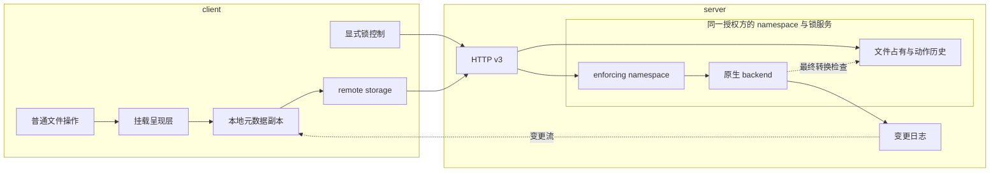

# 顶层设计

本文描述系统由哪些角色构成、各自持有什么、如何交互、数据如何跨角色流动。角色内部的设计不在这里，见 `server/` 与 `client/`。

## 一、两个角色

系统只有两个角色，它们运行在不同的机器上，通过 HTTP 交互。

**server** —— 命名空间与文件占有的权威持有者。它将原生支持发布检查的 **storage** 与对应锁服务配对，经 HTTP 暴露出去。命名空间的事实、有效授权和修改顺序以这里为准。

**client** —— 命名空间的使用者。它通过 remote storage 访问数据，通过显式锁控制取得与核对授权；client 侧还负责把命名空间呈现为本地目录。普通文件打开不自动执行占有策略。

一个 server 面对多个 client（R-CON-1）。client 之间不直接通信。

## 二、系统构成



普通数据操作与显式锁控制使用各自有界的 HTTP 请求；复制的订阅与快照另有长连接。锁控制的 admission 不被大块数据传输占满，变更流也与批量快照分离。

这些通道具有独立的资源与进展要求，不能仅靠同一连接上的逻辑复用承担隔离。

## 三、同一个接口，两个模块

client 侧的 remote storage 与 server 侧的 storage **实现同一份 `storage.Storage` 基础接口**，并提供有界结果扩展 `storage.BoundedStorage`。锁控制与 mutation scope 是另外的成对能力。

它们**不是同一个模块**，也不在同一个角色里：server 侧的那个真正持有数据；client 侧的那个不持有任何数据，它把每次调用翻译成一次 HTTP 请求。

接口相同带来两个直接后果，都不需要额外设计：

- 挂载呈现层只认这个接口，因此**可以直接挂载一份本地 storage，完全不经过网络**。挂载点于是能与一个普通目录逐操作对拍（见 [`../testing.md`](../testing.md)）。
- HTTP 服务端要求 namespace 与锁服务属于同一授权方。代理必须共同转发原有控制身份、动作与 scope，不能在一份不透明的远端 `Write` 外另建本地授权方。

## 四、跨角色契约

基础 storage 描述命名空间操作，锁控制描述跨请求的占有与核对，HTTP 同时承载它们和复制。各自的义务不能由另一层猜测补齐。

**FUSE 到挂载呈现层为止。** 系统里只有这一个组件说 FUSE 协议。它之下的 storage 接口是一份**按路径寻址的命名空间 API**，使用者是挂载呈现层与直接调用这份 API 的程序（R-INT-5），两者拿到的是同一份接口。内核要而命名空间没有的东西 —— 打开的文件、挂载的生命周期，以及内核用来认一个节点的那个编号 —— 由挂载呈现层自己建立并持有，契约因此不必带上内核的形状。

**节点身份是例外，它在契约里**（R-FS-5）。属性带一个 `ID`，说的是「这个名字后面是哪个节点」，与它此刻叫什么无关。挂载呈现层分不出这件事就会把两个活着的节点报成一个：一个描述符会读到别人的字节，而 mmap 了它的程序拿到 SIGBUS。而挂载点只直接观测到自己执行的操作，别的客户端做的改名不经过它的任何一条路径，所以这个答案只能由命名空间给。

**storage 接口**：一份命名空间的存取。命名空间以**相对于根的斜杠分隔路径**寻址，根是空字符串。路径按词法清洗：重复的斜杠、末尾的斜杠、`.` 与 `..` 段都被归并，因此根的各种写法（`""`、`.`、`./`、`a/..`）指的是同一个节点。十一个基础操作各自接受一个 `context.Context`，一次调用完成一次操作；文件句柄与显式占有控制不混入这组词汇：

| 操作 | 形状 |
|---|---|
| `Stat` | 路径 → 属性 |
| `SetAttr` | 路径, 要改的属性 → —；没有点名的属性保持原样 |
| `List` | 目录路径 → 条目，按名字排序，**每个条目内联携带自己的属性** |
| `Read` | 路径 → 整个文件的内容 |
| `Write` | 路径, 内容 → —；文件不在则创建 |
| `Create` | 路径 → —；该处已有任何东西则 `EEXIST` |
| `Mkdir` | 路径 → —；该处已有任何东西则 `EEXIST` |
| `Remove` | 路径 → —；目标是目录则 `EISDIR` |
| `RemoveDir` | 路径 → —；目标是文件则 `ENOTDIR`，目录非空则 `ENOTEMPTY`，目标是根则 `EBUSY` |
| `Rename` | 旧路径, 新路径 → —；覆盖目标处已有的文件；根作为任一操作数则 `EBUSY` |
| `Space` | —（不寻址任何路径）→ 整个命名空间的容量：总量、已用、还能写入的量 |

`storage.BoundedStorage` 在不改变上述十一个操作的前提下增加三项 server-backend 义务：`CheckBounded` 在服务前验证所有依赖都能接收结果预算；`ReadBounded` 在完整 payload 分配前按 byte bound 拒绝；`ListBounded` 把 entry 逐项交给调用方持有的 `ListResult`，在保留超限 entry 之前失败。普通 `Read` 与 `List` 仍是直接调用者可用的整份结果 API；只有要把 namespace 从可嵌入 server 发布出去的调用方必须依赖有界扩展（R-INT-3、R-INT-6）。

属性是节点身份、模式（类型位与权限位）、文件内容的字节数、内容最后被读取的时间与最后改变的时间。身份是一个不透明值，只可比较相等；它随节点走过改名，两个同时存在的节点不共用一个，而 0 不是取值 —— 一个不填它的实现会让每次比较都相等，也就是把所有节点报成同一个节点。可以写回去的是权限位（含 setuid、setgid、sticky）与那两个时间；节点的类型不在其中，`SetAttr` 收到带类型位的模式以 `EINVAL` 拒绝。一次 `SetAttr` 点了不止一个属性时不保证整体生效，报告失败时可能已经改掉了其中一部分。列目录内联属性使得列出 n 个条目花一次调用而不是 n+1 次，这在跨网络时是往返次数的量级差别（R-WS-4）。

根不是任何调用方建出来的节点，删除它、移动它、把别的东西放到它的位置，都不是这个接口提供的操作。若允许，一个根被删掉的命名空间此后对一切回答 `ENOENT` —— 那句话说的是「那个文件不在」，而事实是命名空间不在。

**容量描述整个命名空间**，不描述其中某个子树 —— 一份命名空间就是一个 workspace，「这个子目录还剩多少」是这份契约答不出的问题。三个数各自实测，互不推导（R-WS-5）：还能写入的量不是总量减已用，底下若有更紧的限制就报更紧的那个，因为配额是「还允许写多少」，不是「这些字节一定放得下」。已用可以超过总量 —— 那是配额被下调到已写内容之下的样子，此时还能写入的量是零。

**自己没有容量可报的命名空间以 `ENOSYS` 拒绝。** 这是实现的固有属性，不是这一次调用的状况：会答的一直会答，不会答的从来不答。因此上层既不得把这个拒绝当作可重试的暂时故障，也不得替它推算一个数字。

任何 storage 实现必须满足：

| 义务 | 违反的后果 |
|---|---|
| 内容替换是原子的：并发的读者看到旧内容的全部、或新内容的全部，或者一个说得出「这次没读到」的失败 | 其它 client 读到撕裂的文件（R-CON-3、R-CC-5） |
| 每个操作作用于名字上的那个节点，不是它指向的节点：符号链接被描述为符号链接，`Read` 与 `Write` 对它报 `ELOOP`，设模式报 `EOPNOTSUPP`，设时间落在链接自己身上 | 名字底下悄悄换成了另一个对象，上层的读、写、删除落在它没有点过名的地方（R-ERR-2） |
| 已命名错误以 `syscall.Errno` 呈现；纯请求取消可保留 context 原因，边界通过 `storage.ErrnoOf` 统一分类 | 挂载与传输对同一结果作出不同判断，或把已发生的修改当成可安全重试的请求 |
| 判定不了的情况按错误报告，绝不替换成「不存在」或空目录 | 上层把「够不到」当成「不存在」，据此执行破坏性动作（R-ERR-1、R-ERR-2） |
| 绝对路径、以及爬出根的路径，一律以 `EINVAL` 拒绝 | 命名空间之外的文件可被读写 |
| 容量的三个数能同时为真：都不为负，且还能写入的量不超过 `max(总量 - 已用, 0)` | 这三个数要进内核回复的无符号字段，一个负数在那里变成一个巨大的正数，先查空间再决定写不写的程序据此认为有盘上根本不存在的余量（R-ERR-2） |
| 容量要么如实答出来，要么以 `ENOSYS` 拒绝；绝不报一个推算出来的数字 | 一个凑出来的容量与一个实测的容量在调用方那里长得一模一样，而它是先查空间再写的程序唯一的依据（R-ERR-2、R-WS-5） |
| 答不答容量在一份命名空间的一生中不变：会答的一直会答，不会答的从来不答 | 一次拒绝被读成暂时故障并被反复重试，或者一次回答被读成永久能力而此后不再问（R-WS-5） |
| 两个不同的对象绝不被呈现为同一个；一个对象被删除后，此前指代它的东西不再转而指代别的对象 | 读到的是别人的字节，而没有任何迹象表明发生过这件事（R-INT-11） |
| 由多个可以各自失败的部分拼成的实现，任何一部分够不到都按错误报告，不用还读得到的那部分拼一个看起来成功的答案 | 记着名字却读不到字节被答成一个成功的读，上层据此认为文件是空的（R-ERR-6） |

错误分类区分已接受的取消与未知结果：纯 `context.Canceled` 为 `EINTR`，deadline 与未知故障为 `EIO`。提供 `Classification() error` 的错误拥有其子树的分类；独立故障分支优先于取消，原因链不会把不确定修改改成可重试的取消。取消是否被接受由掌握操作阶段的组件决定，取舍见[请求中断的错误语义](../../.agents/notes/implemented/bug-fix/2026-08-22-eio-from-a-freshly-mounted-mountpoint.md)。

这些义务的可执行形式是 `packages/storage/storagetest`：`Run` 验证一般 namespace 契约，`RunBounded` 验证可发布 server backend 的结果预算与取消义务（R-INT-3、R-INT-6）。

**锁控制接口**：显式创建 Session / Owner，解析现有普通文件，取得、续期、解除与核对 S/X 授予。修改只使用调用方给出的有界不可变 proof 集合，普通读取不声称 grant 有效。所有修改，包括匿名调用，都在原生最终转换处遵守占有顺序；重启通过持久最大时长证据与恢复屏障保留已确认保护。身份、动作结果、当前 grant 状态与内容版本分别定义，完整契约见 [文件锁设计](server/file-locks.md)。

**HTTP 接口**：跨角色的实际边界。v3 转发基础 storage、显式锁控制及复制的订阅、续订、快照，并必须满足：

| 义务 | 违反的后果 |
|---|---|
| 每个答案都带有本协议自己的标记，认不出标记的答案一律按结果未知处理 | 中途的代理或认证网关自己回的 `200` 被当成一次成功的修改 |
| 锁管理的已确定动作结果与 grant 当前生命周期分别传递；过期、退役、未知与未授予不混为一谈 | 响应丢失后重复授予，或把已经确认的保护误认为不存在 |
| mutation scope 完整且有界地到达同一授权方的原生发布检查，非法或失效 proof 不退回匿名执行 | 一次没有权限的修改因中间层丢掉 scope 而成功 |
| 只有可命名的操作结果携带 errno：storage 报错、handler 在调用 storage 前依据资源边界以 `EFBIG`/`EAGAIN` 拒绝，或 mutation 已成功而 handler 无法读取 replication barrier 时以 `EIO` 报告无法确认；其余每一种非成功答案都意味着结果未知 | 一次够不到 server 被读成一句关于命名空间的事实，或一次已经发生的修改被误报成未发生（R-ERR-1、R-ERR-2） |
| errno 以符号名传递，取自双方共有的封闭词汇表；名字不在其中即结果未知 | 一个这一侧不认识的名字被当成某个具体的失败 |
| 响应体的分帧必须能报告自己提前结束 | 被截断的文件与一个恰好这么大的文件无从分辨 |
| 复制帧在 metastore 载入变长字段前取得单帧预算；change/start 与 snapshot cursor 的总量分别由 stream 数推导，snapshot page 另有限制 operation、aggregate retained bytes 与等待者的 admission | wire 端的晚检查挡不住 backend 已经建立的超限 page，多条流还能把各自有界的结果累积成无界总量（R-INT-3） |
| 每种答案的形状是确定的：缺席的属性、缺席的列表、不是 object 的 mutation response、以及 null/畸形/未知字段的 barrier 都不是这个协议的答案 | 一个零值的属性读起来是「1970 年的空文件」，一个缺席的列表读起来是「这个目录是空的」，一个假的 barrier 会让副本过早确认已经发生的修改 |
| 复制那三个操作与请求／响应分在不同的连接上，且一次变更抵达一个健康订阅者的耗时与并发的批量传输无关 | 一次快照 —— 系统里最大的一次批量传输 —— 挤掉自己的事件通道，后果是重新拉一份快照，而触发它只需要一次正常的冷挂载 |
| 不记变更日志的命名空间以 `ENOSYS` 拒绝这三个操作，而不是回一条空的流或一份没有行的快照 | 一份「存在、是空的、永不改变」的命名空间，而这是一个副本会相信的答案 |

client 侧的 remote storage 实现 storage 接口，凡是不满足上述任何一条的答案，它一律以 `EIO` 报告，绝不把它变成一句关于命名空间的话。

## 五、跨角色的数据流

### 元数据有副本，内容没有

**内核查名字、问属性、列目录仍到达 storage**：目录项、属性与负项超时都是 0，这些查询在 client 侧由元数据副本通过 SQLite 答复。走遍一棵已经复制下来的树因此不产生 HTTP 请求。文件页缓存独立于这三个超时，仍能直接答复读请求；它与独立 handle 内容的冲突见 [client 设计](client/architecture.md#二元数据查询来自本地副本)。

副本只有树 —— 名字、类型、属性、大小。文件内容在打开时从服务端取回，此后的读取使用 handle 缓冲区或内核页缓存。

server 每个 workspace 记一条有序的变更日志，位置与树的改动在同一个事务里分配；client 先订阅、再取一次一致性快照，此后由流喂着。副本在观测到流断开时整份作废，到达 replicated storage 的操作以 EIO 失败，没有过期时间或基于间隔的刷新。本地副本在读写阶段之间交接，持续查询不能让已登记的更新一直等待读者空闲；快照重建过早恢复作答的缺口仍会使健康连接上的查询返回旧元数据，见 [client 设计](client/architecture.md#二元数据查询来自本地副本)。

于是跨机器的可见性不依赖轮询：一台机器上的提交完成之后，那条变更走事件流到达另一台机器，`stat` 就看得到（R-CON-1、R-CON-2）。对 metastore-backed namespace，成功的 mutation response 携带一次原子读取的 `(incarnation, committed position)` barrier；replicated client 等到同一代副本的位置不小于它才返回。barrier 可以因并发提交而晚于本次 mutation，但不早于它，因此写完立刻 `stat` 得到的是至少包含这次修改的大小与时间（R-CON-4）。

**绕过 server 的改动不产生变更事件。** `localdir` 没有元数据副本，后续请求仍会直接观察到宿主目录的改动；套了 `limited` 时，这类旁路改动会使配额账本漂移。本地持久对象存储不支持旁路修改其私有格式；无法验证的对象或组合状态以 I/O 错误暴露。

本地另外持有的两样东西不是命名空间的副本：

- **正在被打开的文件的内容**，随描述符出现，随描述符消失。
- **命名空间最后一次报出的剩余空间**，一个数字，正常刷新窗口为一秒；容量探测被分类为 `EINTR` 时不推进窗口，并在改变缓冲区前结束这次写入。这个数字按设计会过期，放过去的写入仍然要由提交来裁决。它的作用是提前把容量拒绝送到 `write(2)` 或 `ftruncate(2)`；命名空间自己在提交处的拒绝才是权威。刷新与 advisory failure 的完整规则见 [client 设计](client/architecture.md#配额在造成它的那次调用处就拒)。

三样都见 `client/architecture.md`；这个决定的全部理由与被否的备选见[元数据复制](../../.agents/notes/implemented/architecture/2026-08-27-metadata-replication.md)。

代价：挂载在副本建好之前不可用，不记变更日志的命名空间（`localdir` 后端）没有副本，它的每一次 `ls`、每一次 `stat` 仍然是一次 HTTP 往返。

### 读

```
程序 open  ──▶ 挂载层 ──▶ remote storage ──HTTP──▶ server ──▶ storage
                          先问大小，再取回整个文件，放进这个描述符的缓冲区
程序 read  ──▶ 挂载层从缓冲区切片，不产生请求
```

storage 的读以整文件为单位，内核的读以 128 KiB 为单位；缓冲区是两者的对接处，没有它，读一个文件的代价随文件大小平方增长。

### 写

```
程序 write ──▶ 挂载层打补丁到缓冲区，不产生请求
程序 close ──▶ remote storage 提交整个文件 ──HTTP──▶ server ──▶ storage
                ├── 成功 ──▶ 其它 client 的下一次读就能看到
                └── 失败 ──▶ 错误返回给 close
```

提交是整份内容的一次替换，替换由 storage 保证原子，因此其它 client 读到的要么是旧内容的全部、要么是新内容的全部（R-CON-3）。未提交的内容只有写它的那个描述符看得到。

命名空间若被置于配额之下，超出配额的提交以 `EDQUOT` 失败 —— 说的是「配额已用尽」，不是「磁盘已满」。挂载层还会拿这次写入要多占的字节数去比对它最后问到的剩余空间，在 `write(2)` 处先拒绝一次：大量程序从不查看 `close(2)` 的返回值，只在提交处拒绝，等于让那些字节无声地消失（R-WS-5）。

### 挂载与卸载

```
remote-fs ──▶ 建立 remote storage，先访问一次根，确认 server 在
          ──▶ 挂载呈现层附着到本地目录
          ──▶ 收到 SIGINT／SIGTERM ──▶ 拆除挂载
```

挂载与卸载是频繁的日常操作（R-WS-2）。冷挂载时本地**无任何既有状态**（R-WS-3）——但它要建立一份：一个私有目录、一个 SQLite 副本、一条订阅，以及一份灌满整棵树的快照，**灌完之前挂载点不可用**。R-WS-4（冷挂载后必须迅速可用）因此被知情推后，理由与代价见[元数据复制](../../.agents/notes/implemented/architecture/2026-08-27-metadata-replication.md)。卸载时那份副本连同它的目录一起删掉：它不跨挂载存活，那不是需求（见 `docs/spec/requirements.md` 的「未列入需求的事项」）。

## 六、部署形态

两个角色各有两种存在方式（R-INT-1、R-INT-4）：

| 角色 | 作为库嵌入 | 作为独立二进制 |
|---|---|---|
| server | `packages/transport/httprest` 提供一个 `http.Handler`，链接进集成方既有的 server | `cmd/remote-fs-server`：服务普通目录、Azure Blob + SQLite，或同一私有目录中的本地对象 + SQLite |
| client | `packages/transport/httprest` 与 `packages/fuse` 链接进集成方既有的 daemon service | `cmd/remote-fs`：把一个 server 的命名空间挂到本地目录 |

client 侧还有第三种用法：只使用 remote storage，不挂载（R-INT-5）。这条路径不依赖 FUSE，因此不受 Linux 限制。

独立二进制的进程与挂载生命周期通过本机信号管理。一个 `remote-fs` 进程就是一个挂载点，卸载靠向它发信号；独立 server 用信号停止、重数普通目录配额或查询存储与锁状态，见 [`server/architecture.md`](server/architecture.md)。文件占有另有跨角色的网络控制接口，不承担进程管理。作为 package 使用时，调用方直接使用所组合 storage 的状态 API。

两个角色之间没有身份认证系统，enrollment 与数据端点的访问由部署方保护。锁能力校验保证已授予保护约束所有修改，不区分调用方是否主动携带 proof；它不限制普通读取，也不替部署方建立用户权限，因此服务仍须位于可信访问边界内。

## 七、第二层

各角色内部的设计各占一个目录，一个角色一份：

- `server/architecture.md` —— HTTP 服务端、请求与响应的形状、错误如何离开 server
- `server/local-disk-object-store.md` —— 本地持久 storage 的格式、打开与恢复、容量和维护
- `server/file-locks.md` —— 显式占有、有限授予、最终发布顺序、重启保护与 HTTP 控制协议
- `client/architecture.md` —— remote storage、挂载呈现层、打开的文件、节点身份、生命周期

第二层只写角色内部，不重讲系统全貌，跨角色只通过本文定义的接口与契约来引用。

## 八、代码组织

代码组织与角色划分不是一回事：一个包可能被两个角色共用（如接口定义与协议词汇），一个角色也可能由多个包构成。

整个仓库是**单个 Go module**，模块路径 `github.com/codetreker/remote-fs`。

```
go.mod

packages/                    可被外部与自身 import
  locking/                   文件权限状态、有限历史与原生发布协调
  storage/                   接口定义、实现者义务与 errno 词汇（两个角色共用）
    locked/                  enforcing backend 与其授权方的配对，提供不可变 scope
    lockcontract/            文件保护义务的共享验收
    localdir/                本地目录实现
    localstore/              把本地对象、SQLite、外部提交见证、锁与恢复组合成一份 storage
    objectstore/             对象存储实现：字节在对象存储里，树在 metastore 里
      azblob/                Azure Blob 的对象接口实现
      localdisk/             本地不可变文件的对象接口实现
      objectstoretest/       对象接口义务的可执行形式
    limited/                 把任意一份 storage 置于字节配额之下
    storagetest/             义务的可执行形式：每个实现都跑这一套用例
  metastore/                 名字的树、节点的属性、路径到对象键的指向
    sqlite/                  SQLite 实现
    metastoretest/           metastore 义务的可执行形式
  transport/                 把 storage 契约搬到线上，一种传输一个包
    httprest/                HTTP：URL 与消息的形状、服务端、拨号端
  fuse/                      挂载呈现层：FUSE 适配；仅 Linux

cmd/                         二进制，不被 import
  remote-fs/                 把一个 server 的命名空间挂到本地目录
  remote-fs-server/          把一份命名空间服务出去

docs/
```

包与角色的对应：

| 包 | 归属 |
|---|---|
| `storage` | 两个角色共用 |
| `storage/storagetest` | 测试专用：namespace 与 bounded-server 契约的可执行形式 |
| `storage/localdir` | server 侧（也用于挂载层不经网络的验证路径） |
| `storage/localstore` | server 侧，持有本地对象与绑定的 SQLite metastore |
| `storage/objectstore`、`storage/objectstore/azblob`、`storage/objectstore/localdisk` | server 侧 |
| `storage/objectstore/objectstoretest` | 测试专用：object-store 字节接口的可执行契约 |
| `metastore`、`metastore/sqlite` | 两个角色共用：server 的 object-store/local-store 与 client 的 metadata replica 都依赖它们 |
| `metastore/metastoretest` | 测试专用：metastore 契约的可执行形式 |
| `storage/limited` | server 侧 |
| `transport/httprest` | 两个角色共用：服务端在 server 侧，拨号端在 client 侧 |
| `fuse` | client 侧 |

这些拆分各自守住一条依赖或 ownership 边界：`storage` 与实现分开，使第三方实现自有存储时只需引入接口（R-INT-6）；配额自成 `storage/limited`，因为它是一层包装而不是某一个实现的性质（R-WS-5、R-INT-3）；`metastore` 与 `storage/objectstore` 分开，因为名字树不持有文件字节，而对象接口不认识路径；`storage/localstore` 负责把两个 durable half、WAL 外部见证、store identity、初始化与 lifetime lock 组合成一个资源，避免这些规则散落在二进制里；契约用例分别属于 `storage/storagetest`、`objectstore/objectstoretest` 与 `metastore/metastoretest`；每种传输自成 `transport/` 下的一个包（R-INT-9、R-INT-10）；`fuse` 与传输分开，使得不挂载的使用者不被 FUSE 与平台限制绑住（R-INT-5、R-INT-8）。

带依赖的实现各自成包，使依赖跟着选择走：`localdir` 不链接 Azure SDK 或 SQLite；`localdisk` 不链接 Azure SDK；`localstore` 明确选择 SQLite 与本地对象格式；`azblob` 才选择 Azure SDK。

errno 词汇归 `storage` 而非某一种传输：一个实现可以报出哪些错误，是契约的性质。若它留在某一种传输里，第二种传输要么抄一份而后各自漂移，要么去 import 第一种。

一种传输的两端同处一个包：它们共用消息类型，分开会给二者留出漂移的空间。两端都只用 `net/http`，因此合在一起不会牵入任何多余依赖。

只 import 其中一部分的集成方不会链接其余部分的代码。若将来依赖面本身成为问题，任一子目录都可以就地变成独立 module 而不改变其 import 路径。
